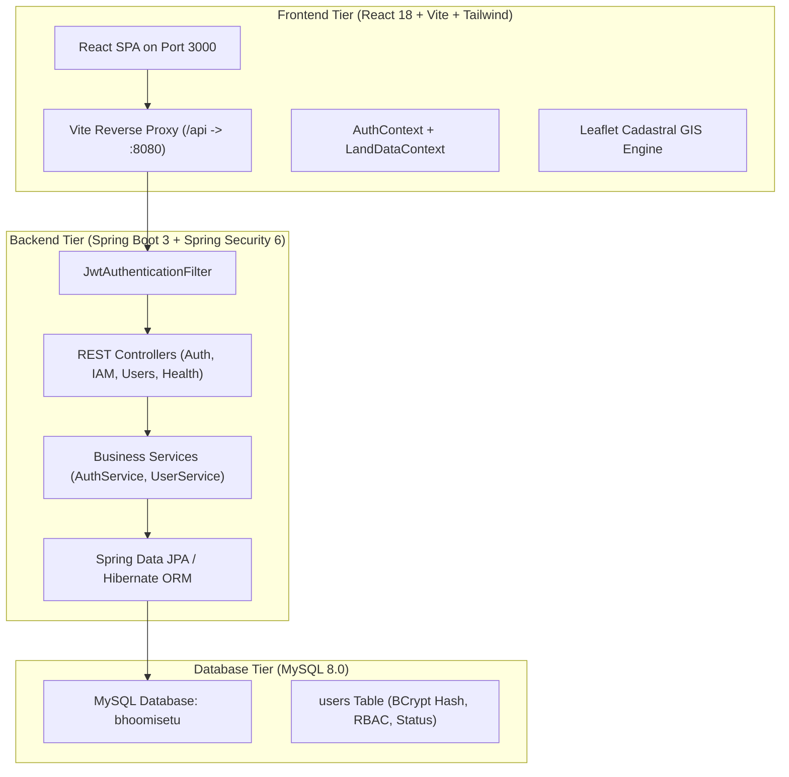

# BhoomiSetu System Architecture

BhoomiSetu is built on a 3-tier enterprise architecture engineered for high availability, security, and scalability.

## Technology Stack

| Layer | Component | Version / Tech |
|---|---|---|
| **Client UI** | React, Vite, Tailwind CSS, Lucide Icons, Recharts, Leaflet | React 18, Vite 6, Leaflet 1.9 |
| **API Gateway / Proxy** | Vite Proxy & Spring Security CORS | Port 3000 -> Port 8080 |
| **Application Server** | Java 17, Spring Boot, Spring Web | Spring Boot 3.3.3 |
| **Security & Auth** | Spring Security, JJWT (HMAC SHA-512), BCrypt | JJWT 0.11.5, BCrypt 10 rounds |
| **Persistence / ORM** | Spring Data JPA, Hibernate, MySQL Connector/J | Hibernate 6.5, MySQL Driver 8.3 |
| **Database** | MySQL Server 8.0 | `localhost:3306` / `bhoomisetu` |
