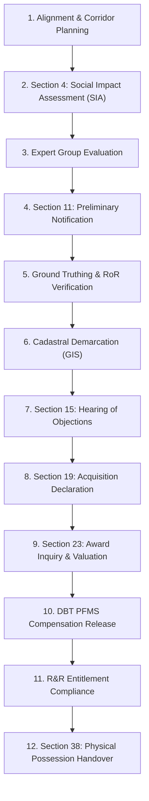

# RFCTLARR Act 2013 Statutory Acquisition Workflow

BhoomiSetu digitizes and streamlines the 12 statutory stages mandated by the **Right to Fair Compensation and Transparency in Land Acquisition, Rehabilitation and Resettlement Act, 2013 (RFCTLARR Act)**.

## Stage Descriptions

1. **Stage 1 — Alignment & Corridor Planning**: Project Agency (NHAI, DMRC, Railways) defines the project boundary and identifies affected revenue villages and survey khasras.
2. **Stage 2 — Section 4 (SIA)**: Notification for Social Impact Assessment studying displacement, public purpose, and livelihood impacts.
3. **Stage 3 — Expert Group Evaluation**: Multi-disciplinary appraisal committee examines the SIA report.
4. **Stage 4 — Section 11 (Preliminary Notification)**: Official gazette notification in state/central portals prohibiting land transfers.
5. **Stage 5 — Ground Truthing & RoR Verification**: Field CALA / Tehsildar cross-checks Bhulekh records, land mutations, and ownership deeds.
6. **Stage 6 — Cadastral Demarcation (GIS)**: High-accuracy ETS / DGPS boundary demarcation overlaid on digital cadastral maps.
7. **Stage 7 — Section 15 (Objections)**: 60-day window for land owners to submit objections regarding ownership, boundary, or valuation.
8. **Stage 8 — Section 19 (Acquisition Declaration)**: Formal declaration approved by the Competent Authority (District Magistrate).
9. **Stage 9 — Section 23 (Award Inquiry & Solatium)**: CALA calculates 100% solatium, multiplier factors (1.0x to 2.0x), and individual award determinations.
10. **Stage 10 — DBT Compensation Disbursement**: Direct bank transfer via PFMS / Aadhaar Payment Bridge System (APBS).
11. **Stage 11 — R&R Compliance**: Housing units, one-time subsistence grants, and mandatory rehabilitation compliance monitoring.
12. **Stage 12 — Section 38 (Physical Possession Handover)**: Final handover of encumbrance-free Right of Way (ROW) to the project agency.
